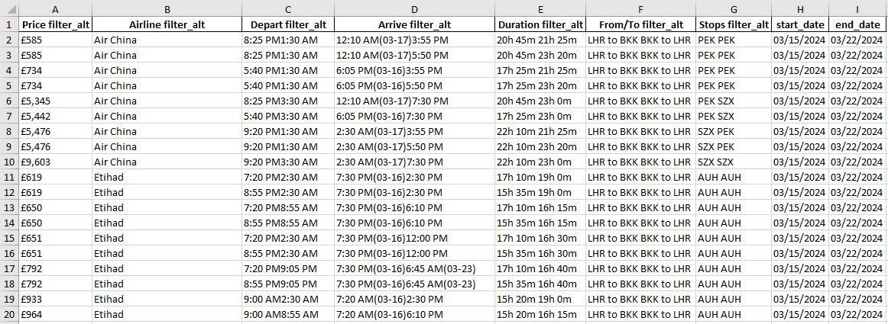

# ITAmatrix Price Scraper

This Python script utilizes [Playwright](https://playwright.dev/) and [Beautiful Soup](https://www.crummy.com/software/BeautifulSoup/) to scrape flight data from the [ITA Matrix - https://matrix.itasoftware.com](https://matrix.itasoftware.com) website. The scraped data is then stored in an Excel file.

## Overview
- The script uses Playwright to automate interactions with the ITA Matrix website and collect flight data.
- User inputs for origin, destination, start date, and end date are validated.
- The script iterates over a date range, fills out the ITA Matrix search form, and collects data for each date.
- The collected data is organized into pandas dataframes and saved to an Excel file with separate sheets for each date.

## Usage

1. Clone the repository.
```bash
git clone https://github.com/AviDataGeek/ITAmatrix_price_scraper
```

2. Install required libraries via pip.
```bash
pip install -r requirements.txt
```

3. Run the script.
```bash
python main.py
```

4. Follow the prompts to input the origin, destination, start date, and end date in the specified format.

5. Output should be saved into an Excel file named `output.xlsx`. Make sure to check the generated Excel file for the collected flight information.


## Example
Here is the data scraping example

 - View on ITAMatrix website

 - Output on Excel sheet


## Details
Used functions into this script is detailed below.

- `origin_input()`: Takes user input for the origin airport in 3-char IATA format.
- `destination_input()`: Takes user input for the destination airport in 3-char IATA format.
- `start_date_input()`: Takes user input for the start date in MM/DD/YY format.
- `end_date_input()`: Takes user input for the end date in MM/DD/YY format.
- `wait_for_table_load(page)`: Waits for the main table to load on the webpage.
- `wait_for_carrier_table_load(page,carrier)`: Waits for carrier-specific table to load after clicking on a carrier.
- `read_screen(page,starting_date,ending_date,dataframes)`: Reads the table contents for carriers and returns dataframe objects.
- `flight_data_scraper(origin,destination,start_date,end_date)`: Main function to initiate the web scraping process.

Feel free to contribute! ✈